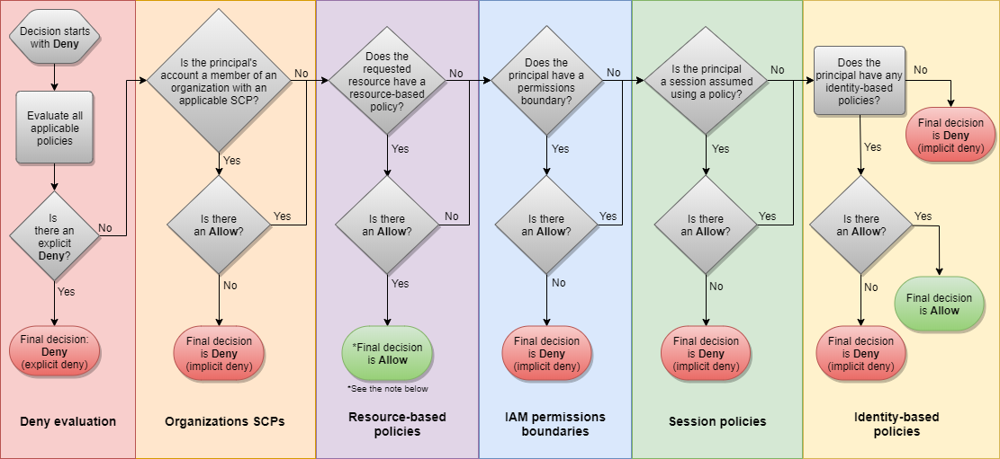
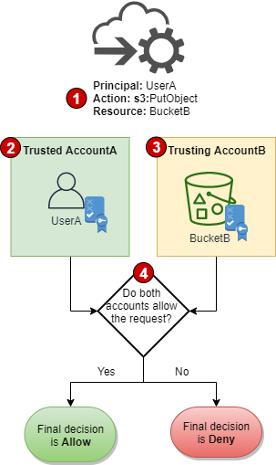
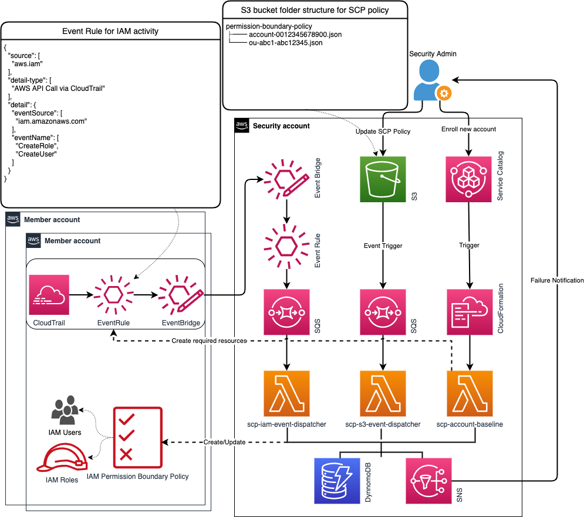
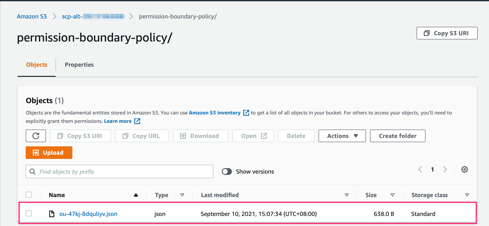
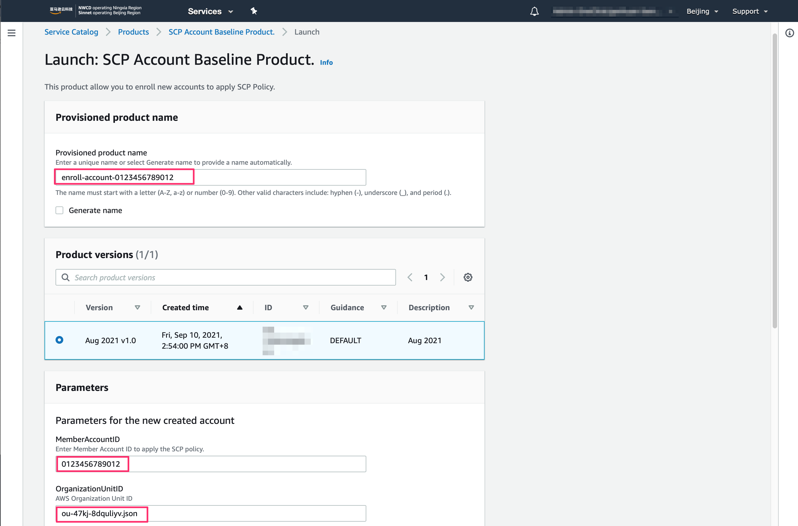
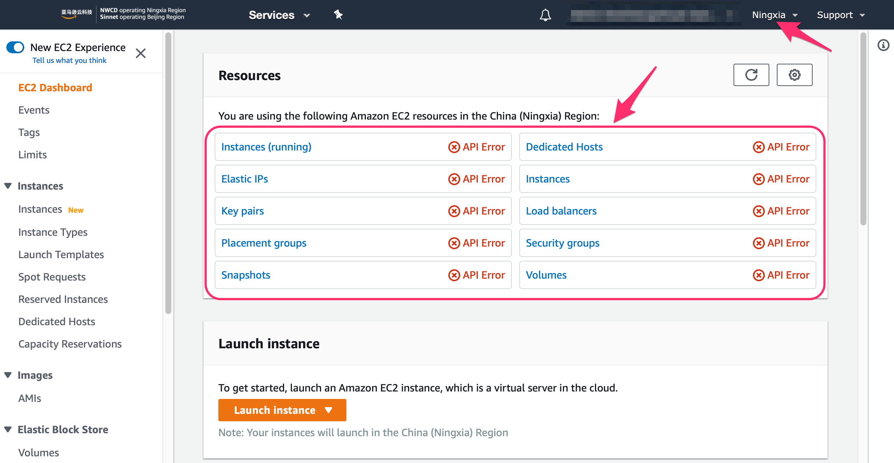
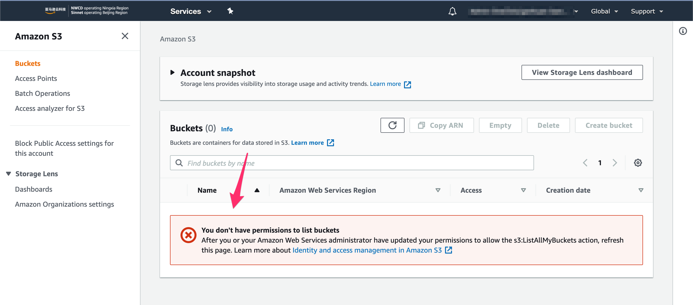
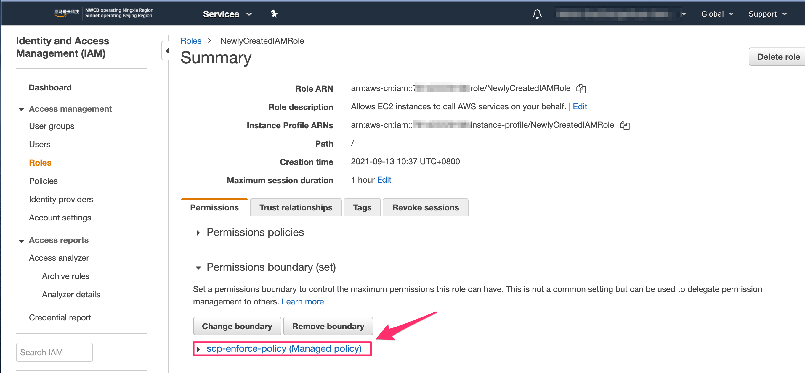

# SCP Alternative Solution For China Region

AWS Organizations provides central governance and management for multiple accounts. Central security administrators use [service control policies (SCPs)](https://docs.aws.amazon.com/organizations/latest/userguide/orgs_manage_policies_scps.html) with AWS Organizations to establish controls that all IAM principals (users and roles) adhere to.

However, Service Control Policies (SCPs) feature in AWS Organizations is not available in the China regions (BJS and ZHY) yet as time of writing.

This repository is part of [the Chinese blog post](https://aws.amazon.com/cn/blogs/china/scp-alternative-based-on-iam-permission-boundaries/) that guides users through implementing a SCP Alternative Solution for China Region from scratch.

Table of Contents
=================

* [Rationale](#rationale)
* [Architecture Overview](#architecture-overview)
* [Deployment](#deployment)
   * [Build Artifacts](#build-artifacts)
   * [Deployment for Management Account](#deployment-for-management-account)
   * [Deployment for Security Account](#deployment-for-security-account)
* [User Guide](#user-guide)
   * [Use Case 1: Initialize S3 bucket for the SCP polices files](#use-case-1-initialize-s3-bucket-for-the-scp-polices-files)
   * [Use Case 2: Initialize the member account to be managed by SCP Alternative solution](#use-case-2-initialize-the-member-account-to-be-managed-by-scp-alternative-solution)
   * [Use Case 3: Update SCP policy](#use-case-3-update-scp-policy)
   * [Use Case 4: Apply the SCP policy to newly created IAM roles and users](#use-case-4-apply-the-scp-policy-to-newly-created-iam-roles-and-users)
   * [Use Case 5: Subscribe the failures for lambda execution](#use-case-5-subscribe-the-failures-for-lambda-execution)
   * [Use Case 6: Move to native SCP](#use-case-6-move-to-native-scp)
* [Limitation](#limitation)
* [Recommendation](#recommendation)
* [License](#license)

## Rationale

Before diving into the architecture, let’s learn more about policy evaluation logic in AWS.



In an AWS account where SCP is applied, the above flow chart provides details about [Determining whether a request is allowed or denied within an account
](https://docs.aws.amazon.com/IAM/latest/UserGuide/reference_policies_evaluation-logic.html#policy-eval-denyallow).



In a multi account environment, you'll also need to consider [Cross-account policy evaluation logic](https://docs.aws.amazon.com/IAM/latest/UserGuide/reference_policies_evaluation-logic-cross-account.html) as the figure above.

Based on the evaluation logic in AWS multi-account environment, SCPs are similar to IAM boundaries, in that they define the maximum set of actions that can be allowed. The difference is that SCPs applies to principals of accounts, and IAM permission boundary applies to principals of IAM users and roles.

Based on the rationale above, the SCP alternative solution is to implement an automated pipeline to ensure the "SCP policies" are applied to all IAM user/roles within the target account by IAM permission boundary policy.

## Architecture Overview

The purpose of the design is to simulate the native SCP as possible as we can, also considering the migration path to native SCP once it’s available.



The architecture is based on AWS native services, the core AWS services used are:

* **S3 bucket** - It's used to store SCP custom policies. In native SCP provided by AWS Organizations, users can directly edit and update the SCP policy file through the console. In this alternative design, the SCP policy files are uploaded to a dedicated S3 bucket of the security account, and the corresponding event notification is configured for the bucket to detect any changes for the updates of the SCP policies.
* **SCP Service Catalog** - It provides a friendly user interface for administrators to manually register accounts that need to apply the SCP policies. In native SCP provided by AWS Organizations, by using the account structure created in AWS Organizations, it can apply SCP policy on the account or organizational unit level. In this alternative design, all accounts that need to apply the SCP policies need to manually register and initilized from this SCP Service Catalog Product.
* **Event Rule and CloudTrail** - It continuously monitors the API activities of newly created IAM users or roles in the account, and send the events to the Lambda of the security account for further processing, and apply the IAM Permission Boundary to the newly created IAM users and roles. In the native SCP provided by AWS Organizations, the SCP policy is applied to the entire account, and any newly created IAM users and roles will automatically apply the SCP policy. Since this solution is based on IAM Permission Boundary, whenever a new user or role is created, it's required to ensure that the newly created user or role also applies the IAM Permission Boundary.
* **Lambda functions**:
    * *scp-account-register* - It's used to register and initialize the account that needs to be apply the SCP policy, and store the account information in DynamoDB for other Lambda functions to query account related info.
    * *scp-iam-event-dispatcher* - It's used to receive events of newly created IAM users and roles in registered accounts, and apply the corresponding IAM Permission Boundary to the newly created IAM users or roles
    * *scp-s3-event-dispatcher* - It's used to receive the update event of the policy file in the S3 bucket, and automatically update the IAM permission boundary policy accroding to the updated SCP policy file in the registered accounts.
* *SNS* - It's used to receive information about the failure of SCP policy creation and binding. The security administrator can opt-in to subscribe to the SNS Topic to get timely failure notifications
* *DynamoDB* - It is used to store the registered account meta-information for query. The format of the stored information is as follows:

|AccountId|MgtId|OuId|ScpCustomPolicyList (L)|ScpPolicyPathList (L)|ScpUpdateTime (S)|
| --- | ----------- | --- | ----------- | --- | ----------- |
|1123456789|2123456789|OU-abcd-xxxxxxxx|[ { "S" : "arn:aws-cn:iam::1123456789:policy/CustomPermissionBoundaries" }]|[ { "S" : "permission-boundary-policy/ou-abcd-xxxxxxxxx.json" }]|Tue Jul 20 11:00:38 2021|

## Deployment

<details>
<summary>Click me to expand</summary>

The infrastructure required in this solution can be deployed by the CloudFormation templates.

### Prerequisites

Prior to deploying the solution to your environment, it is necessary to have the appropriate prerequisites. Verify that your AWS multi-account environment has the supported prerequisites before starting the installation.

*	The solution is target on AWS multi-account environment, so the security account and management account is supposed to exist.
*	It needs the ability to access to member accounts from the management account. An IAM role OrganizationAccountAccessRole will be created by default to allow management account to assume to member accounts if the member accounts created via AWS Organizations. The role is required to be created manually if it doesn’t exist. The role name can also be customized during the deployment if it’s not the default role name OrganizationAccountAccessRole in some cases.
*	The security account can assume the role in the management account, with the assumed role, it can assume to the member accounts. The deployment steps below will walk you through to deploy the required IAM roles for the capability.

### Build Artifacts

Clone the repository, and switch to the top-level folder of the repo. Run `make` command:

```bash
➜  make
zip assets/scp-s3-event-dispatcher.zip lambda/scp-s3-event-dispatcher.py
updating: lambda/scp-s3-event-dispatcher.py (deflated 74%)
zip assets/scp-iam-event-dispatcher.zip lambda/scp-iam-event-dispatcher.py
updating: lambda/scp-iam-event-dispatcher.py (deflated 77%)
zip assets/scp-account-register.zip lambda/scp-account-register.py
updating: lambda/scp-account-register.py (deflated 77%)
cp -f cloudformation/scp-service-catalog-product-template.yaml assets/scp-service-catalog-product-template.yaml
```

The lambda artifacts and the required cloudformation template are created under `assets` directory:

```
➜  ls assets
scp-account-register.zip                  scp-s3-event-dispatcher.zip
scp-iam-event-dispatcher.zip              scp-service-catalog-product-template.yaml
```

### Deployment for Management Account

Log in to the management account, select the CloudFormation template file [010-create-iam-role-in-master-account.yaml](cloudformation/010-create-iam-role-in-master-account.yaml), and create an IAM role that allows the security account to assume to:

* **ManagementAccountAccessRoleName** - The name of the role deployed in the management account, used to allow the security account to assume to the management account, ensure that the parameters deployed under the security account are consistent
* **OrganizationAccessRoleName** - The name of the role deployed in all member accounts, used to allow the management account Assume to each member account, ensure that the parameters deployed under the security account are consistent
* **SecurityAccountID** - The AWS Security Account ID

### Deployment for Security Account

Login to Security account and perform the following deployment:

* Select the CloudFormation template file [020-create-s3-bucket-in-security-account.yaml](cloudformation/020-create-s3-bucket-in-security-account.yaml) to create an S3 bucket for CloudFormation deployment.
    * *Note*: The SCP policy files must be uploaded to the bucket folder **permission-boundary-policy** in the security account, The naming convention of the policy files are:
        * Account-level policy file: `account-<ACCOUNT-ID>.json`
        * Organization unit level file: `<OrganizationUnit-ID>.json`
* The assets file has been created in step __Build Artifacts__. Upload all the files in the assets directory to the root directory of the above S3 bucket.
* Select the CloudFormation template file [030-create-scp-infra-in-security-account.yaml](cloudformation/030-create-scp-infra-in-security-account.yaml) to create the required infrastructure.
    * **ManagementAccountID** - The AWS management Account ID
    * **ManagementAccountAccessRoleName** - The name of the role deployed in the management account, used to allow the security account to assume to the management account, ensure that the parameters deployed under the management account are consistent
    * **OrganizationAccessRoleName** - The name of the role deployed in all member accounts, used to allow the management account to assume to each member account, ensure that the parameters deployed under the management account are consistent
    * **SCPCatalogAdministrator** - The name of the IAM role/user deployed under the security account, this role/user will be the administrator of the Service Catalog Product of the SCP Account Register
        * IAM Role: e.g role/Operation
        * IAM User: e.g user/Alice

</details>

## User Guide

<details>
<summary>Click me to expand</summary>

After the deployments, all required infra resources for the solutiion are created successfully. Follow the instructions below to manage the "SCP policies" in the alternative solution.

### Use Case 1: Initialize S3 bucket for the SCP polices files

With the alternative solution, the SCP policy is defined in a json file and stored in S3 bucket. The SCP policy file for the Organization Unit or Account must exist in advance.

* Login to security account, a dedicated S3 bucket should created to store the "SCP polices". The naming convention is `scp-alt-<Security-Account-ID>`.
* Rename the SCP policy file with the required naming convention (E.g Rename [010-region-beijing-only.json](sample-scp-policies/010-region-beijing-only.json) to `ou-47kj-8dquliyv.json` for demo purpose)
    * *Note*: The SCP policy files must be uploaded to the bucket folder **permission-boundary-policy** in the security account, The naming convention of the policy files are:
        * Account-level policy file: `account-<ACCOUNT-ID>.json`
        * Organization unit level file: `<OrganizationUnit-ID>.json`
* (Optional) Create the a folder `permission-boundary-policy` in the S3 bucket manually if the folder doesn't exist
* Upload the SCP policy file for the organization unit or account to the folder `permission-boundary-policy`


### Use Case 2: Initialize the member account to be managed by SCP Alternative solution

For any AWS accounts which needs to be managed by the alternative solution, it's required to be registered and initilized via the SCP Service catalog product first.

> Make sure the SCP policy file for the account or the organization unit is already uploaded to the S3 bucket above.

* Login to security account, navigate to `Service Catalog` service, choose the service catalog product `SCP Account register`, and click launch:

  - Input the product name, e.g: `enroll-account-0123456789012`
  - Input the AWS Account id to be registered, e.g: `0123456789012`
  - Input the AWS Organization Unit ID for the account, e.g: `ou-47kj-8dquliyv`
* Wait the product to be created successfully
> Behind the sense, the lambda function *scp-account-register* deployed in security account will be triggered by the CloudFormation stack.
* Login to the registered account by using the administrator IAM role (`OrganizationAccountAccessRole` by default), an IAM policy `scp-enforce-policy` is created and associated to all IAM users/roles in the member account except the administrator IAM role.
* Login to the registered account by using non-administrator IAM entity, check if the deny actions defined in the SCP policy file works in the account.
  - For the [test SCP test policy](sample-scp-policies/010-region-beijing-only.json), it will be like:


### Use Case 3: Update SCP policy

In case the actions in SCP policy need to be updated, follow the instructions to update the policy:

* Follow the [SCP policy syntax](https://docs.aws.amazon.com/organizations/latest/userguide/orgs_manage_policies_scps_syntax.html) to update the target SCP policy file (E.g Rename [020-deny-all-S3-actions.json](sample-scp-policies/020-deny-all-S3-actions.json) to `ou-47kj-8dquliyv.json` for demo purpose)
* Login to security account, upload the updated SCP policy file to S3 bucket under folder `permission-boundary-policy` (Overwrite the existing file directly if it already exists.)
> Behind the sense, the lambda function *scp-iam-event-dispatcher* deployed in security account will be triggered by the object update event configured in the S3 bucket.
* Login to the registered account by using non-administrator IAM entity, check if the updated actions defined in the SCP policy file are updated automatically in the member account.
  - For the [test SCP test policy](sample-scp-policies/020-deny-all-S3-actions.json), it will be like:


### Use Case 4: Apply the SCP policy to newly created IAM roles and users

In many case that the user should have the ability to create new IAM user or role via CLI/Console/SDK. As long as the account is registered, with the dedicated event rule and cloudtrail deployed in the target account, any newly created IAM users/roles will automatically attach the IAM permission boundary policy, to be restricted by "SCP policy".

The steps below demostrate how the newly created IAM user/role is retricted by IAM permission boundary policy.

* Register the account via Service Catalog Product as described above.
* Continuously check the confguration of the IAM permission boundary for this new IAM role/user.
> Behind the sense, the event rule deployed in this account captures the IAM activity, and trigger the lambda function *scp-iam-event-dispatcher* deployed in security account.
* The IAM role/user attaches the IAM permission boundary policy automatically after lambda execution.


### Use Case 5: Subscribe the failures for lambda execution

In the case (E.g: the size of the policy exceeds limit 6,144 characters), the execution of the lambda function is failed. The security administrators need to get notified as soon as possible to mitigate the issue.

A dedicated SNS topic is created in the account, the security administrators can opt-in subscribe the failures events.

* Update the CloudFormation Stack deployed in security account.
* Input the desired email address in parameter `Email` to subscribe the failure notifications.

### Use Case 6: Move to native SCP

This is for the case that it needs to move to native SCP with SCP feature is natively supported in AWS Organizations. The steps below will work through to finish the migration from SCP alternative solution to native SCP.

* Get the service control policy (SCP) that you previously created and stored in S3 bucket, [attach the SCP to the organizational unit (OU) accordingly.](https://docs.aws.amazon.com/organizations/latest/userguide/orgs_manage_policies_scps_attach.html)
> Note: The SCP syntax is exactly the same between SCP Alternative Solution and Native SCP. You don't need any modifications on the "SCP Policies" while moving to native SCP.
* Terminate all provisioned products for account register created via step [Use Case 2: Initialize the member account to be managed by SCP Alternative solution](#use-case-2-initialize-the-member-account-to-be-managed-by-scp-alternative-solution)
* Terminate the CloudFormation Stacks created in step [Deployment for Security Account](#deployment-for-security-account)
* Terminate the CloudFormation Stacks created in stesp [Deployment for Management Account](#deployment-for-management-account)

</details>

## Limitation

This is a SCP workaround solution by using AWS IAM's permission boundary, the user should be aware of the limitations prior to using it:

1. Since it is based on AWS IAM's permission boundary, which is essentially an IAM managed policy. The size of each managed policy cannot exceed 6,144 characters per the [doc](https://docs.aws.amazon.com/IAM/latest/UserGuide/reference_iam-quotas.html#reference_iam-quotas-entity-length).
1. The feature [SCP policy inheritance](https://docs.aws.amazon.com/organizations/latest/userguide/orgs_manage_policies_inheritance.html) in AWS Organizations is not supported in the alternative solution. It's required to create the policy in S3 bucket for each organization unit.
1. The infra resources created for the solution in registered accounts are not allowed to be modified, these `Deny` actions will be appended to the default IAM permission boundary policy by default.
```json
    {
        "Sid": "EnforceDeny1",
        "Effect": "Deny",
        "Action": [
            "iam:DeleteUserPermissionsBoundary",
            "iam:DeleteRolePermissionsBoundary"
        ],
        "Resource": "*",
        "Condition": {
            "ArnNotLike": {
                "aws:PrincipalArn": "arn:aws-cn:iam::*:role/<Protected-IAM-Role>"
            }
        }
    },
    {
        "Sid": "EnforceDeny2",
        "Effect": "Deny",
        "Resource": [
            "arn:aws-cn:iam::<Target-AWS-Account-ID>:policy/scp-enforce-policy",
            "arn:aws-cn:cloudtrail:cn-north-1:<Target-AWS-Account-ID>:trail/scp-trail",
            "arn:aws-cn:s3:::scp-trail-bucket-<Target-AWS-Account-ID>",
            "arn:aws-cn:events:cn-north-1:<Target-AWS-Account-ID>:rule/scp-event-rule"
        ],
        "Condition": {
            "ArnNotLike": {
                "aws:PrincipalArn": "arn:aws-cn:iam::*:role/<Protected-IAM-Role>"
            }
        }
    }
```
4. The core resources in the solution are deployed in security account, it's crucial to ensure the actions executed in the lambda functions won't be affected by attached IAM permission boundary policy. Therefore by default it's not allowed to register the security account into the SCP service catalog.
5. During the creation of the IAM permission boundary for the registered accounts, it's required to assume to the registered accounts from the master accounts to manage the IAM permission boundary policy. To avoid the permission issues caused by the attached IAM permission boundary policy, the IAM admin role (`OrganizationAccountAccessRole` by default) is reserved to not attach any IAM permission boundary policies. The user can specify custom role name by CloudFormation parameter `OrganizationAccessRoleName` during the deployment.
6. Since the solution is based on IAM Permission Boundary, the allow actions are needed in the SCP policy files to have effective permissions. Details please see [Evaluating effective permissions with boundaries](https://docs.aws.amazon.com/IAM/latest/UserGuide/access_policies_boundaries.html#access_policies_boundaries-eval-logic).
> In most of the cases, the allow all actions should be given as defined in [the example policy](https://github.com/aws-samples/scp-alternative-solution/blob/main/sample-scp-policies/010-region-beijing-only.json#L4-L9).

## Recommendation

1. As the services and features in AWS China regions are moving very quickly, it's highly recommended to move to native SCP feature once it's available in AWS China regions.
1. It’s recommended to manage the SCP policies files in SCM and managed by CICD to avoid human errors.
1. The SCP policy is supposed to be tested first in non-prod environment before moving to production according to the best practice.

## License

This sample code is made available under the MIT-0 license. See the LICENSE file.
